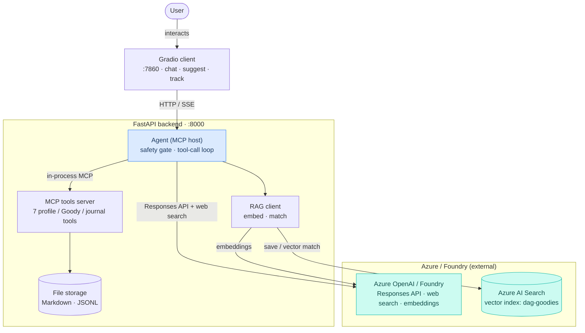

# Do Any Good (DAG)

A safety-aware assistant that helps you do one good deed — a **Goody** — each day. A Goody can
be something for others or something good you do for yourself (rest, learning, health, a small
joy). The agent suggests deeds, keeps a profile, tracks what you complete, and can act as a
thematic diary.

> This is the lean text MVP. Voice, image input, a calendar view, and Foundry IQ
> storage are deferred — see [PLAN.md](PLAN.md).

## Architecture



- **Backend agent** (`backend/app/agent`) — runs a safety gate, then a tool-calling loop. It is
  an MCP *host*: it connects to the tools server in-process and exposes the tools to the model, plus
  a **built-in web search** tool (Bing-grounded, run server-side by Azure/Foundry — no external API).
- **MCP tools server** (`backend/app/mcp_server`) — a real MCP server over the storage layer
  (profile, Goodies, journal). Used in-process by the agent; can also run standalone over stdio.
- **Storage** (`backend/app/storage`) — profile as Markdown + JSON frontmatter (versioned),
  Goodies as JSONL, journal as Markdown, under `DAG_DATA_DIR` (default `./data`).
- **RAG** (`backend/app/rag.py`) — on completing a Goody, an *anonymized* profile → Goody record is
  embedded (Azure OpenAI) and stored in **Azure AI Search** (the vector engine behind Foundry IQ);
  weekly planning folds in one Goody from a similar profile. No-ops when unconfigured.
- **Gradio client** (`client/gradio_app.py`) — chat, suggestions, progress overview, tracking.

## Quick start (Windows / PowerShell)

```powershell
python -m venv .venv
.\.venv\Scripts\Activate.ps1
pip install -r requirements.txt

# Terminal 1 — backend (agent API)
python -m uvicorn backend.app.main:app --reload

# Terminal 2 — Gradio client
python -m client.gradio_app
```

Then open the URL the client prints (default http://127.0.0.1:7860). Without a configured
Foundry endpoint the backend uses a **mock** LLM, so the UI runs offline for development.

## Configuration

Copy `.env.example` to `.env` and fill in what you have:

| Variable | Purpose |
|----------|---------|
| `FOUNDRY_RESPONSES_URL` | Full URL of the Foundry / Azure OpenAI Responses endpoint |
| `FOUNDRY_API_KEY` | API key / bearer token |
| `FOUNDRY_MODEL` | Model / deployment name (required for Azure OpenAI) |
| `FOUNDRY_PROJECT` | Foundry project (optional) |
| `DAG_DATA_DIR` | Storage directory (default `data`) |
| `DAG_BACKEND_URL` | Backend base URL the Gradio client calls (default `http://localhost:8000`) |

If `FOUNDRY_RESPONSES_URL` or `FOUNDRY_API_KEY` is missing, the backend falls back to the mock.

## HTTP endpoints

| Method & path | Purpose |
|---------------|---------|
| `POST /chat` | Converse with the agent (`{message, history}` → `{reply, history}`) |
| `POST /plan/today` · `POST /plan/week` | Generate + persist suggestions |
| `GET /goodies` | List Goodies (filters: `status`, `date_from`, `date_to`) |
| `POST /goodies/{id}/status` | Mark `done`/`missed` with an optional summary |
| `GET /overview` | Progress summary (counts, self/others, grouped lists) |
| `POST /journal` · `GET /journal` | Append / read the journal |
| `GET /health` | Health check |

## Optional: run the MCP tools server standalone

The agent uses the tools server in-process, so this is only needed if an external MCP client
should reach the tools directly:

```powershell
python -m backend.app.mcp_server.server   # stdio transport
```

## Run with Docker

One image runs both services; compose starts them together.

```powershell
Copy-Item .env.example .env   # fill in your Foundry / Azure values
docker compose up --build
```

Open the client at http://localhost:7860 (it reaches the backend at
`http://backend:8000` on the compose network). Profile/Goody files persist in the
`dag-data` volume; only the backend receives the `.env` secrets.

### Deploy to Azure

Build/push the image and run the two services (e.g. as two **Azure Container Apps**):

```powershell
az acr build -r <registry> -t do-any-good:latest .
```

- Provide the `.env` values as Container App env vars/secrets — they're never baked
  into the image (`.env` is git- and docker-ignored).
- Point the client's `DAG_BACKEND_URL` at the backend app's internal URL; expose
  only the client publicly.
- Mount Azure Files at `/app/data` for persistence across restarts (the RAG index
  already lives in Azure AI Search; full storage migration to Foundry IQ is in
  [PLAN.md](PLAN.md)).

## Development

```powershell
pytest          # full test suite (mocked LLM — no live calls)
ruff check .    # lint
```
